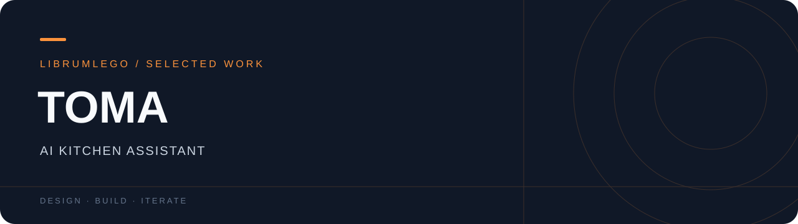

<div align="center">
<h3>텍스트·음성·사진·링크를 레시피와 조리 흐름으로 연결하는 Android 앱.</h3>
<p>Kotlin · Jetpack Compose · Room · OpenAI API</p>
<p><a href="https://app.notion.com/p/3b7694a2940281ebba01d45143ddacb9">프로젝트 스토리 ↗</a> · <a href="https://github.com/LibrumLego">개발자 포트폴리오 ↗</a></p>
</div>

---

## At a glance

| 제품 경험 | 구현 포인트 |
| :--- | :--- |
| 텍스트·음성·사진·링크를 레시피와 조리 흐름으로 연결하는 Android 앱. | 다양한 입력을 레시피 데이터로 정리하고, 저장·탐색·음성 안내를 하나의 흐름으로 연결합니다. |

캡스톤 팀 프로젝트 · 개별 기여 범위는 프로젝트 상세의 근거와 함께 확인할 수 있습니다.

## Team · 여포

명지대학교 컴퓨터공학과 · 2026학년도 1학기 캡스톤디자인1 · 4인 팀 프로젝트  
지도교수: 김상귀

| 팀원 | 담당 영역 | 주요 역할 |
| :--- | :--- | :--- |
| **국지민 · 팀장** | 시스템 아키텍처 및 서버 데이터 설계 총괄 | 전체 데이터 흐름 설계, OpenAI 기반 레시피 구조화 및 AI 처리 로직 설계, 멀티모달 입력 처리 및 서버 데이터 구조 설계 총괄 |
| **윤도현** | Android 앱 개발 및 서버 통신 | 음성 인식·음성 명령 처리 구현, openWakeWord 기반 호출어 감지 구조 구현, 네트워크 통신 및 오디오 처리 로직 개발 |
| **배연진** | Android 프런트엔드 및 UI 구현 | 홈·저장소·레시피 화면 UI, 사용자 인터랙션 및 상태 기반 화면 흐름 설계, 즐겨찾기·최근 기록 UI 구현 |
| **정호진** | VUI 디자인 및 UI 구현 | Figma 기반 음성 중심 인터페이스 디자인, 조리 단계 시각화 가이드, 음성 가이드 UI 구성 |

<sub>역할 출처: 「캡스톤디자인 최종보고서(2차)」 2.4 팀 구성 및 역할(본문 3–4쪽). 위 역할은 보고서에 기재된 분담이며, 아래 제품 기능은 팀 공동 결과물입니다.</sub>

<details>
<summary><strong>기능 · 구조 · 로컬 실행 가이드</strong></summary>

<div align="center">
  
  <h1>TOMA</h1>
  <p><strong>재료와 링크를 한 끼의 레시피로 바꾸는 AI 주방 도우미</strong></p>
  <p>텍스트 · 음성 · 사진 · 유튜브/블로그 링크에서 레시피를 발견하고 저장하세요.</p>
  <p>
    <a href="https://github.com/LibrumLego/Toma">Repository</a>
    · Android · Jetpack Compose · Kotlin
  </p>
</div>

## 프로젝트 소개

TOMA는 “오늘 뭘 먹지?”라는 순간을 줄이기 위해 만든 Android AI 레시피 앱입니다. 사용자가 가진 재료, 떠오른 메뉴, 참고하고 싶은 링크를 입력하면 레시피 탐색부터 저장·다시 보기까지 한 흐름으로 이어집니다.

> **Portfolio summary**  멀티모달 입력과 외부 콘텐츠 수집을 하나의 모바일 UX로 연결한 AI 주방 도우미

## 핵심 경험

| 입력 방식 | TOMA가 해주는 일 |
| --- | --- |
| 재료·메뉴 텍스트 | 자연어로 레시피 검색 및 생성 |
| 음성 | 손을 쓰기 어려운 요리 중 음성 검색 |
| 사진 | 음식·레시피 이미지를 바탕으로 분석 시작 |
| 유튜브·블로그 링크 | 외부 레시피 콘텐츠를 가져와 정리 |

## 주요 기능

- **AI 레시피 검색** — 재료와 메뉴를 자연어로 입력해 맞춤 레시피 탐색
- **멀티모달 입력** — 텍스트, 음성, 사진, 웹 링크를 하나의 검색 흐름으로 제공
- **레시피 저장소** — 마음에 드는 레시피를 저장하고 다시 확인
- **최근 분석 기록** — 이전에 확인한 레시피를 빠르게 재방문
- **AI 채팅 및 음성 가이드** — 레시피를 보며 질문하고 조리 과정을 따라가기
- **타이머·알림** — 조리 단계에 맞춰 시간을 놓치지 않도록 보조
- **안전한 설정 관리** — API 키는 로컬 환경에서 주입하고 앱 코드에 직접 노출하지 않음

## 화면 설계 포인트

- 따뜻한 오렌지 포인트 컬러로 식욕과 친근함을 전달
- 홈 화면에서 검색·가져오기·최근 기록을 한 번에 보여주는 정보 구조
- 카드와 칩 중심의 짧은 탐색 동선으로 입력 부담 최소화
- 저장소, 채팅 기록, 설정으로 이어지는 일관된 내비게이션

## 기술 스택

- **Language**: Kotlin
- **UI**: Jetpack Compose, Material 3
- **Architecture**: ViewModel + Navigation Compose
- **Data**: Room, Firebase Storage
- **Network**: OkHttp, Gson, Coil
- **AI / Content**: OpenAI API, 외부 레시피·이미지 수집 모듈
- **Build**: Gradle Kotlin DSL, KSP

## 프로젝트 구조

```text
app/src/main/java/com/capstone/toma/
├── ui/screen       # 홈, 채팅, 레시피 상세, 저장소, 설정 화면
├── ui/component    # 공통 상단바, 드로어, 액션 메뉴, 로딩 UI
├── navigation      # TOMA 화면 전환과 목적지 정의
├── viewmodel       # 검색·채팅·레시피 저장 상태 관리
├── model           # 레시피 및 입력 데이터 모델
└── storage         # 로컬 데이터 저장 계층
```

## 실행 방법

1. Android Studio에서 프로젝트를 엽니다.
2. 프로젝트 루트의 `local.properties`에 필요한 키를 추가합니다.

```properties
OPENAI_API_KEY=your_openai_api_key
FOOD_SAFETY_API_KEY=your_food_safety_api_key
NAVER_CLIENT_ID=your_naver_client_id
NAVER_CLIENT_SECRET=your_naver_client_secret
```

3. 에뮬레이터 또는 Android 기기를 연결합니다.
4. 다음 명령으로 디버그 APK를 빌드합니다.

```bash
./gradlew :app:assembleDebug
```

> 키가 없는 환경에서도 프로젝트 구조와 UI 프리뷰를 확인할 수 있지만, AI·외부 콘텐츠 기능은 각 서비스 키가 필요합니다.

## 포트폴리오에서 보여주는 것

- AI 기능을 단순 호출이 아니라 **입력 → 분석 → 저장 → 재방문** 사용자 여정으로 설계
- Compose 기반 컴포넌트화와 화면별 ViewModel 분리
- 외부 콘텐츠, 이미지, 음성, 로컬 저장을 하나의 앱 경험으로 통합
- 민감한 설정값을 로컬 프로퍼티와 환경 변수로 분리

## License

개인 포트폴리오 및 캡스톤 프로젝트 용도로 관리합니다.


</details>

---

<sub>Jimin Kook · LibrumLego / 프로젝트 설명과 실행 가이드는 저장소 기준으로 관리합니다.</sub>

